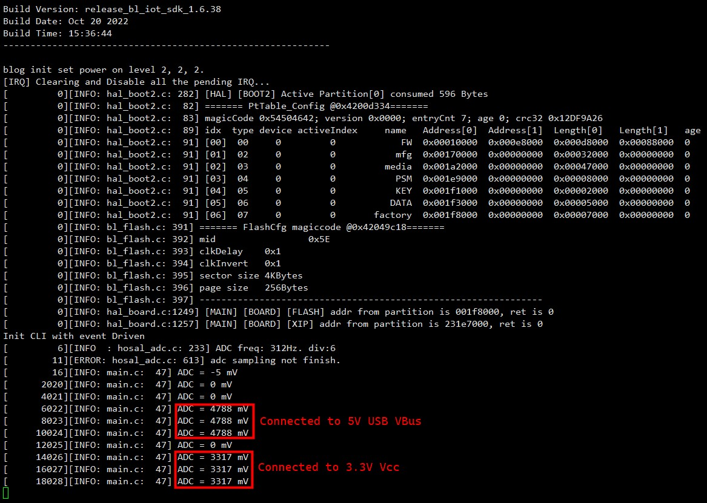

安信可 ADC 示例参考
=============

***********
Example 
***********
Ai-WB2 Series SoC Module ADC usage

Hardware Setup and Wiring
::::::::::

+---------------------------------+--------------------------------------------+
| Ai-WB2 Series SoC Module Pinout |Peripheral Pinout                           |
+=================================+============================================+
| ADC                             |  Voltage Probe (i.e. 3.3V or 5V VCC pinout)| 
+---------------------------------+--------------------------------------------+
| 3V3                             |  VCC                                       |
+---------------------------------+--------------------------------------------+
|GND                              |  GND                                       |
+---------------------------------+--------------------------------------------+

Build and Flash
::::::::::
``shell``

``make -j``

``make flash``

Run
::::::

Troubleshooting
:::::::::

For any technical queries, please open an [issue](https://github.com/Ai-Thinker-Open/Ai-Thinker-WB2/issues) on GitHub. We will get back to you soon.