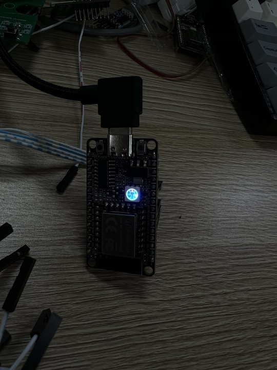
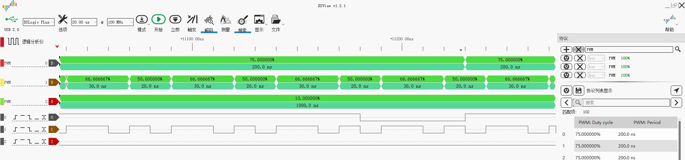

安信可 PWM示例参考
=============

***********
Example 
***********
Ai-WB2 Series SoC Module Hardware PWM Module Output

Hardware Setup and Wiring
::::::::::

+---------------------------------+--------------------------------------------+
| Ai-WB2 Series SoC Module Pinout |LED Pinout                                  |
+=================================+============================================+
| IO14                            |   Red                                      | 
+---------------------------------+--------------------------------------------+
| IO17                            |  Green                                     |
+---------------------------------+--------------------------------------------+
|IO3                              |  Blue                                      |
+---------------------------------+--------------------------------------------+
|3V3                              |  VCC                                       |
+---------------------------------+--------------------------------------------+
|GND                              |  GND                                       |
+---------------------------------+--------------------------------------------+

Build and Flash
::::::::::
``shell``

``make -j``

``make flash``

Run
::::::

Logic Analyzer Output
::::::

See [data.csv] for complete output.

`data.csv详见链接 <https://github.com/Ai-Thinker-Open/Ai-Thinker-WB2/blob/beta/v1.0.5/applications/peripherals/demo_pwm/img/data.csv>`__

Troubleshooting
:::::::::

For any technical queries, please open an [issue](https://github.com/Ai-Thinker-Open/Ai-Thinker-WB2/issues) on GitHub. We will get back to you soon.