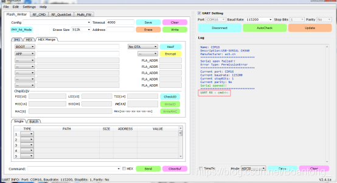
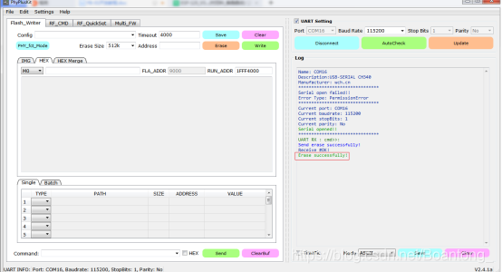
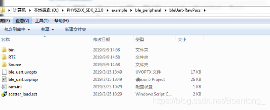
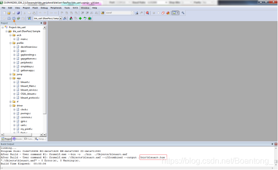
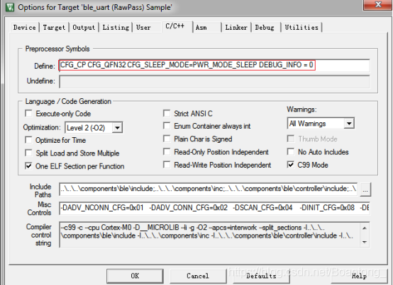
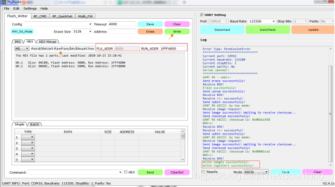

奉加PB系列
====

1. 简介
~~~~~~
安信可科技针对物联网设计通用型的蓝牙模组，其功能强大、用途广泛。可以用于智能灯、智能插座、智能空调等其他智能家电。同时符合BLE 5.0及SIG Mesh规范，可直接通过智能手机组建Mesh网络，也可对接天猫精灵等智能音箱，适用于多种智能家居应用场景。

- 1.1mm 间距 SMD-20 封装；6 路 PWM 输出；
- 采用BLE 5.0 协议，支Sig Mesh，支持天猫精灵/APP语音控制。
- 支持半孔焊盘和天线孔和板载天线。半孔焊盘可把天线引导主板上，天线孔可在模组上直接焊接弹簧天线；
- 亮度（占空比）调整范围 5%-100%，PWM 输出频率 1KHz；
- 支持ESP32-G蓝牙网关通讯，实现远程随时随地控制；
- 支持windows环境SDK二次开发，资料代码全部开源，支持AT指令接入天猫精灵；
- 支持Android/IOS APP和微信小程序控制；
  
更多资料请转跳： `安信可官方docs <https://docs.ai-thinker.com/blue_tooth_pb>`__

2. 开发环境搭建
~~~~~~~~~~~~

2.1 BLE基础知识
:::::::::::::
Ble 协议栈中的 GAP 层负责处理设备访问模式，包括设备发现、建立连接、终止连接、初始化安全管理和设备配置，所以在 ble 协议栈中有不少函数均是以 GAP 为前缀，这些函数会负责以上的内容。
GAP 层总是作为下面四个钟角色之一：

- Broadcaster 广播者——不可以连接的一直在广播的设备；
- Observer 观测者——可扫描广播设备，但不能发起建立连接的设备；
- Peripheral 从机 ——可被连接的广播设备，可以在单个链路层连接中作从机。
- Central 主机 ——可以扫描广播设备并发起连接，在单个链路层或多链路层中
- 作为主机。
- 在典型的蓝牙低功耗系统中，从机设备广播特定的数据，以便让主机知道他是一个可以连接的设备，广播内容包括设备地址以及一些额外的数据，如设备名、服务等。主机收到广播数据后，会向从机发送扫描请求 ScanRequest，然后从机将特定的数据回应给主机，称为扫描回应 ScanResponse。主机收到扫描回应后，便知道这是一个可以建立连接的外部设备，这就是设备发现的全过程。此时，主机可以向从机发起建立连接的请求，连接请求包括下面一些参数。
- 连接间隔——在两个 BLE 设备的连接中使用调频机制，两个设备使用特定的信道收发数据，然后过一段时间后再使用新的信道。（链路层处理信道切换），两设备在信道切换后收发数据称之为连接事件，即使没有应用数据的收发，两个设备任然会通过交换链路层数据来维持连接，连接间隔就是两个连接事件之间的时间间隔，连接间隔以1.25ms 为单位，连接间隔的值为 6（7.5ms）~3200（4s）。
- 从机延时——这个参数的设置可以使从机跳过若干连接事件，这给了从机更多的灵活度，如果它没有数据发送时，可以选择跳过连接时间继续休眠，以节省功耗。
- 管理超时——这是两个成功连接事件之间的最大允许的间隔，如果超过了这个时间
（这个值的单位是 10ms）而没有成功的连接事件，设备被认为丢失连接，返回到未
连接状态，管理超时的范围是 100（100ms）~3200（32s）另外，超时值必须大于有效的连接间隔[有效的连接间隔=连接间隔*（1+从机延时）]。
- 安全管理——只有已认证的连接中，特定的数据数据才能被读写，一旦连接建立，两个设备进行配对，当配对完成后，形成加密连接的密钥，在典型的应用中，外设请求集中器提供密钥来完成配对工作。密钥是一个固定的值，如 000000，也可以随机生成一个数据提供给使用者，当主机设备发送正确的密钥后，两设备交换安全密钥并加密认证链接。在许多情况下，同一对外设和主机会不时的连接和断开，ble 的安全机制中有一项特性，允许两个设备之间建立长久的安全密钥信息，这种特性称为绑定，他允许两设备连接时快速的完成加密认证，而不需要每次连接时执行配对的完整过程。

2.2 安装开发环境
::::::::::::

- 拷贝 SDK 至工作目录。
- 安装 MDK Keil5 for ARM 开发环境。 
- 通过 MDK 打开 SDK 目录中的样例的项目文件即可对项目进行编译调试等操作。

2.3 编译运行Demo
:::::::::::
使用PlyPlusKit 工具擦除开发板已经烧录的固件，RST和PROG按键同时按下：

出现UART RX : cmd>>:信息，则表示进入了烧录模式，点击Erase,擦除成功如图：

从浏览器的 SDK 安装目录下的example\ble_peripheral选择一个样例，比如 bleUart-RawPass，打开MDK 项目文件。

使用KEIL软件编译，生成HEX文件。

3. 调试和烧写
~~~~~~~~~~~~

在MDK工具栏按钮，点击 Option for target 按钮 ，打开项目的 option 对话框。

在 C/C++标签页的 Preprocessor SymbolsDefine 里面，开发者可以改变对应的预编译宏： 

- CFG_SLEEP_MODE=PWR_MODE_SLEEP ：使能低功耗模式，固件程序执行过程中， 会在空闲过程进入睡眠，睡眠之后调试器无法进行调试跟踪，断点也失效。
- CFG_SLEEP_MODE=PWR_MOD_ENO_SLEEP ：关闭低功耗模式，固件程序执行过 程中，处理器一直处于唤醒状态。 
- DEBUG_INFO=1：使能调试信息，默认通过串口输出：P9(Tx),P10(Rx) 
- DEBUG_INFO=0：关闭调试信息

如下图所示，烧录程序成功！

