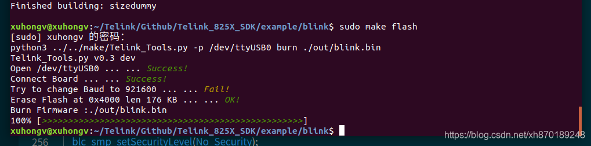
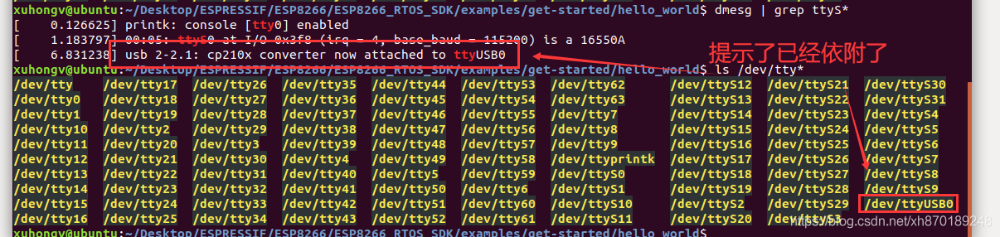

泰凌微TB系列
===========

1. 简介
~~~~~~~~
安信可科技针对物联网设计通用型的蓝牙模组，其功能强大、用途广泛。可以用于智能灯、智能插座、智能空调等其他智能家电。同时符合BLE 5.0及SIG Mesh规范，可直接通过智能手机组建Mesh网络，也可对接天猫精灵智能音箱，适用于多种智能家居应用场景。

更多资料请转跳： `安信可官方docs <https://docs.ai-thinker.com/blue_tooth>`__

2. 开发环境搭建
~~~~~~~~~~

2.1 安装软件和依赖
::::::::::::
**推荐环境：**

- GCC：gcc version 7.4.0 (Ubuntu 7.4.0-1ubuntu1~18.04.1) 
- Python：3.6
- 内核：Linux ubuntu 5.3.0-28-generic #30~18.04.1-Ubuntu  x86_64 GNU/Linux

为了更好大家玩玩，这里给大家小白入门安装 Linux 系统；
下载 VM 虚拟机 版本15.5.1， `点我下载 <https://www.vmware.com/go/getworkstation-win>`__
:: 
    https://www.vmware.com/go/getworkstation-win

和谐码： **FC7D0-D1YDL-M8DXZ-CYPZE-P2AY6**

下载镜像，这里选择ubuntu桌面版18.04.4版本， `点我下载 <http://mirrors.aliyun.com/ubuntu-releases/18.04.4/ubuntu-18.04.4-desktop-amd64.iso>`__
:: 
    http://mirrors.aliyun.com/ubuntu-releases/16.04/ubuntu-16.04.6-desktop-amd64.iso

重要的一步，VM安装乌邦图步骤请参考如下教程， `点我访问 <https://jingyan.baidu.com/article/f96699bb147a73894e3c1b2e.html>`__
导进之之后，我们还需要安装几个常用的软件 ：
:: 
    sudo apt-get purge vim-common
    sudo apt-get install vim
    sudo apt install yum
    sudo apt install git
还有一个Python3.6要安装哈！
::
    sudo add-apt-repository ppa:fkrull/deadsnakes
    sudo apt-get update
    sudo apt-get install python3.6
    python --version
    sudo apt-get install python3-pip 
    sudo update-alternatives --install /usr/bin/python python /usr/bin/python2 100
    sudo update-alternatives --install /usr/bin/python python /usr/bin/python3 150
    sudo apt install python3-serial
    sudo update-alternatives --config python

2.2 安装环境
:::::::::::

下载链接获取工具链：
::
    wget https://shyboy.oss-cn-shenzhen.aliyuncs.com/readonly/tc32_gcc_v2.0.tar.bz2
解压到 opt文件夹里面，之后得到的文件夹名字是《tc32》:
::
    sudo tar -xvjf tc32_gcc_v2.0.tar.bz2 -C /opt/
设置环境变量， **不懂linux小白的同学，认真看下面的动图哈** ：

- 之后按下 i 表示嵌入代码： `vim ~/.bashrc` 
- 任意一处添加  表示嵌入代码： `export PATH=$PATH:/opt/tc32/bin`
- 按下esc 再 :wq 表示写入保存： `source ~/.bashrc`
- 测试是否设置变量成功： `tc32-elf-gcc -v`

.. only:: format_html

   .. image:: ../../../_static/tb/2020022422013424.gif

.. only:: format_latex

   .. image:: ../../../_static/tb/2020022422013424.png

2.3 安装SDK并编译
::::::::::::::::

以下SDK代码为同步安信可GitHub仓库，并通过git拉取:
::
    sudo git clone https://github.com/Ai-Thinker-Open/Telink_825X_SDK.git
**注意，务必让文件夹有全部权限，否则编译不通过！**
:: 
    sudo chmod  777 * -R Telink_825X_SDK
下面编译一个点亮LED 的程序：
::
    cd Telink_825X_SDK/example/blink/ 
    make all //编译固件
    sudo make flash //烧录固件

- 清理残留： **make clean**
- 编译固件： **make all**
- 打开串口监控： **make monitor**

3. 常见问题
~~~~~~~~~~

3.1 如何查看是否开发板已连接到虚拟机Linux了？
::::::::::::::::::::::::::::::::::::::::::::::::::::::

先通过查看是否依附，再看看是否在列表中？ **2条指令即可！**
::
    dmesg | grep ttyS*
    ls /dev/tty*

3.2 权限问题 /dev/ttyUSB0
:::::::::::::::::::::::::
**使用某些 Linux 版本向 TB-02 烧写固件时，可能会出现 Failed to open port /dev/ttyUSB0 错误消息。此时，可以将当前用户增加至 :ref: `Linux Dialout 组 <linux-dialout-group>`。**

因为默认情况下，只有root用户和属于dialout组的用户会有读写权限，因此直接把自己的用户加入到dialout组就可以了。操作完命令后要重启一下，就永久生效了。
::
    xuhongv@ubuntu:~$ sudo usermod -aG dialout xuhongv
