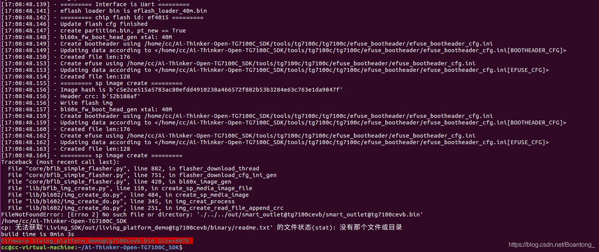
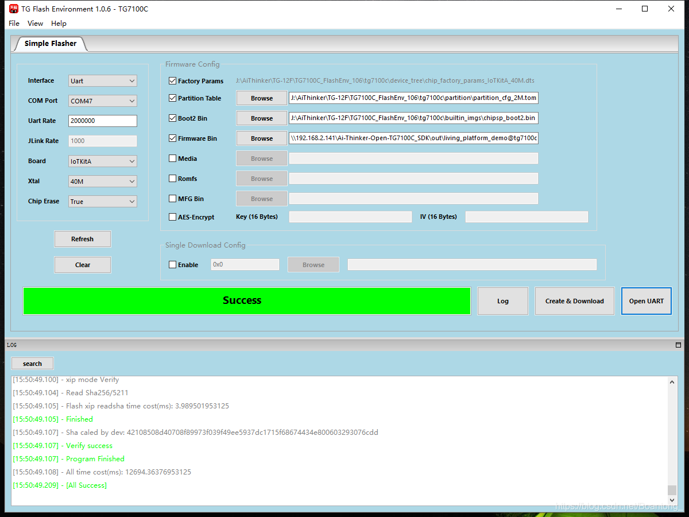
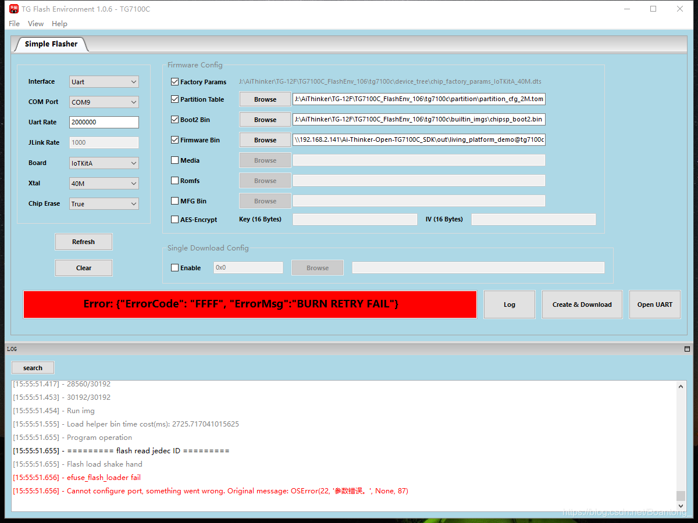

TG-12F
======

1. 简介
~~~~~~~
 `平头哥官方资料获取 <https://occ.t-head.cn/vendor/detail/download?id=3840454249402605568&vendorId=3706716635429273600&module=1#sticky>`__

TG-12F模块采用平头哥TG7100C芯片，TG7100C 是智能新一代高集成 Wi-Fi 和 BLE 组合芯片。无线子系统包含 2.4G 射频、Wi-Fi 802.11b/g/n 和 BLE 基带/MAC 设计。微控制器子系统包含一个低功耗 32 位 RISC CPU、高速缓存和存储器。电源管理单元提供灵活的设置实现低功耗模式，并支持多种安全功能。

产品特性：

- 802.11b/g/n，Wi-Fi+BLE5.0 Combo，支持 STA，Soft AP 和 Sniffer模式
- 采用开源自主可控 RISC-V CPU，1～160MHz 可调，276KB SRAM
- 超快连接：冷启动快连仅 70ms
- 超远距离：最大发射功率 21dBm，灵敏度-98dBm，多穿透一堵墙。
- 高安全性：支持安全启动、安全调试、AES 128/192/256 加密引擎、WPA3、MD5、SHA-1/224/256、PKA（RSA/ECC）加密     引擎
- 支持 Wi-Fi 和 BLE 共存

应用场景：

- 智能照明
- 智能开关
- 智能插座
- 智能家电
- 监控遥控

2. 开发环境搭建依赖
~~~~~~~~~~~~~~~
目前TG-12F开发环境仅支持Linux环境，不支持windows环境。

**注意**

- 不要使用 Windows 下 Ubuntu 子系统，建议使用虚拟机软件安装 Ubuntu。
- 不要在 Windows 下载解压代码再拷贝到 Ubuntu 系统中，建议直接在 Ubuntu 系统内下载和解压代码，建议使用 git clone 下载代码。
- 不要把代码存放在 Windows 共享目录下，然后通过 mount 挂载到 Ubuntu 系统里。建议直接在Ubuntu 系统内下载和解压代码。

安装 Ubuntu（版本 16.04 X64）程序运行时库。请您按顺序逐条执行命令:
::
    sudo apt-get update
    sudo apt-get -y install libssl-dev:i386
    sudo apt-get -y install libncurses-dev:i386
    sudo apt-get -y install libreadline-dev:i386

安装 Ubuntu（版本 16.04 X64）依赖软件包。请您按顺序逐条执行命令:
::
    sudo apt-get update
    sudo apt-get -y install git wget make flex bison gperf unzip
    sudo apt-get -y install gcc-multilib
    sudo apt-get -y install libssl-dev
    sudo apt-get -y install libncurses-dev
    sudo apt-get -y install libreadline-dev
    sudo apt-get -y install python python-pip

安装 Python 依赖包。请您按顺序逐条执行命令:
::
    python -m pip install setuptools
    python -m pip install wheel
    python -m pip install aos-cube
    python -m pip install esptool
    python -m pip install pyserial
    python -m pip install scons

**说明:**

- 安装完成后，请您使用 aos-cube --version 查看 aos-cube 的版本号，需确保 aos-cube 的版本号大于等于 0.5.11。
- 如果在安装过程中遇到网络问题，可使用国内镜像文件。
- 安装/升级 pip

执行以下指令：
:: 
    python -m pip install --trusted-host=mirrors.aliyun.com -i https://mirrors.aliyun.com/pypi/simple/ --upgrade pip

基于 pip 依次安装第三方包和 aos-cube
:: 
    pip install --trusted-host=mirrors.aliyun.com -i https://mirrors.aliyun.com/pypi/simple/ setuptools
    pip install --trusted-host=mirrors.aliyun.com -i https://mirrors.aliyun.com/pypi/simple/ wheel
    pip install --trusted-host=mirrors.aliyun.com -i https://mirrors.aliyun.com/pypi/simple/ aos-cube

1. 获取SDK
~~~~~~~~~~~~~~~
执行： 
::
    git clone -b release_1.6.6 https://gitee.com/Ai-Thinker-Open/Ai-Thinker-Open-TG7100C_SDK.git

4. 编译
~~~~~~~~~
快速编译 living_platform_demo示例。
::
   ./build.sh example living_platform_demo tg7100cevb MAINLAND ONLINE 0

SDK 根目录 build.sh 文件说明如下，根据硬件使用的模组型号和要编译的应用，修改文件中的如下参数:

- default_type="example" //配置产品类型
- default_app="living_platform_demo" //配置编译的应用名称
- default_board="tg7100cevb" //配置编译的模组型号
- default_region=MAINLAND //配置设备的连云区域,配置为 MAINLAND 或 SINGAPORE 都可以，设备可以全球范围内激活
- default_env=ONLINE //配置连云环境，默认设置为线上环境（ONLINE）
- default_debug=0 // Debug log 等级
- default_args="" //配置其他编译参数[非必选参数]
- 编译完成后，在 out/living_platform_demo@tg7100cevb/目录下会生成 living_platform_demo@tg7100cevb.bin文件。该文件为需要烧录到真实设备中的固件。  

**说明：**

build.sh 脚本会自动判断模组的 toolchain（交叉编译工具链）是否已经安装，如果没有安装，脚本会自动安装。
编译出错常见问题：

- 不要使用 Windows 下 Ubuntu 子系统，建议使用虚拟机软件安装 Ubuntu。
- 不要在 Windows 下载解压代码再拷贝到 Ubuntu 系统中，建议直接在 Ubuntu 系统内下载和解压代码，建议使用 git clone 下载代码。
- 不要把代码存放在 Windows 共享目录下，然后通过 mount 挂载到 Ubuntu 系统里。建议直接在Ubuntu 系统内下载和解压代码。

5. 烧录
~~~~~~~~~~
进入烧录模式先将IO8拉高进入烧录模式。

- 开发板接线：开发板已默认将IO8拉高，直接用Micro-USB线将开发板和电脑连接起来即可
- 模组接线

        =========  =========  
        TG-12F      USB  to  TTL
        =========  =========  
            TX          RX
            RX          TX
            IO8         DTR
            EN          RST/RTS
            VDD         3.3V
            GND         GND
        =========  =========
下载 `TG7100C_FlashEnv烧录调试工具 <https://occ-oss-prod.oss-cn-hangzhou.aliyuncs.com/userFiles/3706713731985244160/resource/3706713731985244160smJBaJkFPK.zip>`__

- 在下载的文件包里面打开文件夹docs下的 `TG Flash Environment` 用户手册
- 打开 `TGFlashEnv.exe`

按照TG Flash Environment用户手册步骤配置好点击下载。

**注意:**
如果出现以下错误，大概率是USB-TTL不支持此波特率，可以把波特率设置低一点试试，建议使用1M以下波特率。

下载完成后将IO8拉低进入运行模式，复位运行程序。
在串口调试助手把DTR打勾可实现IO8拉低，点击复位即可运行程序，默认波特率为921600

