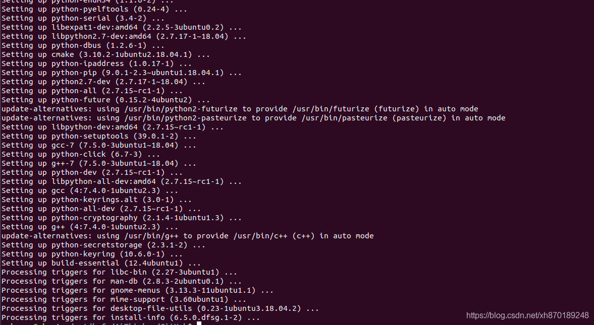
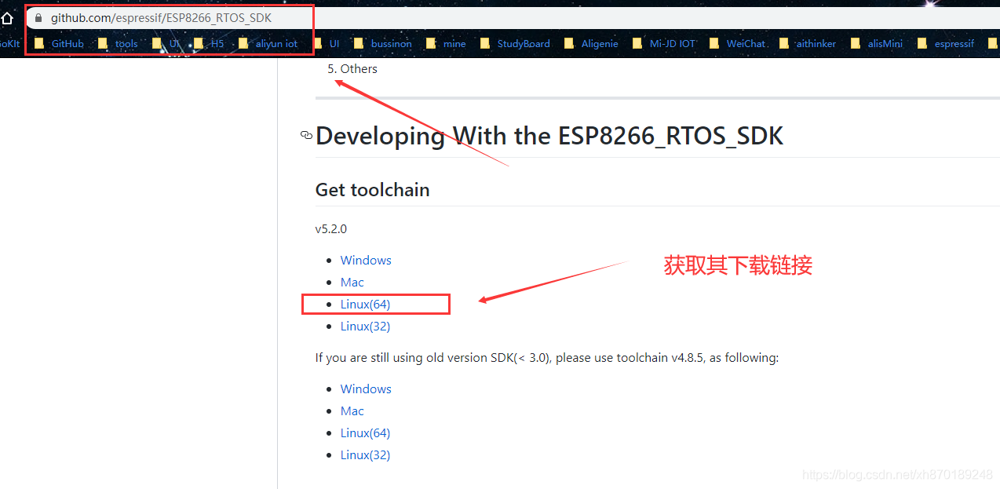
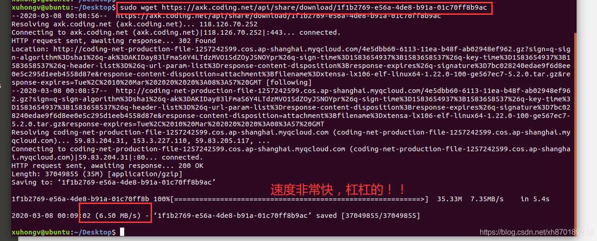
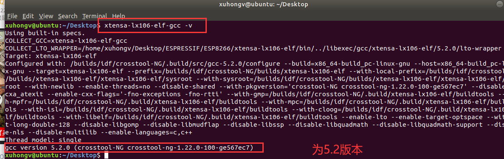
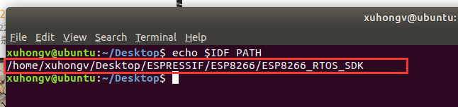
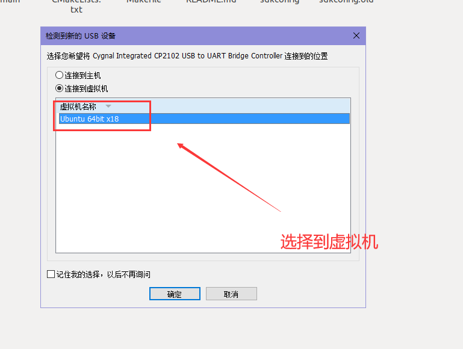
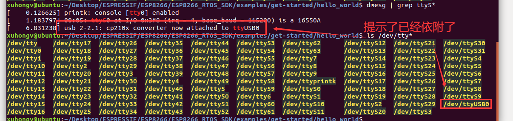

ESP8266系列
====

.. raw:: html

   

--------------

ESP8266 如此多的编程方法，有SDK/Arduino/Lua/MicoPython等，我到底选择哪个?
-----------------------------------------------

  即使更多的编程方法，其调用的都是C为底层的，但是根据项目需求来选型编程方式，能使你的项目快速落地即可。我司推荐使用SDK编程开发，

  - 采用C语言编程，跨平台移植性强；
  - 如果使用 cmake 需要将例程中 CMakeLists.txt 文件内的链接配置一同复制。

--------------

ESP8266 rtos 环境搭建
---------------------------------------------

本博文搭配视频教学： `https://www.bilibili.com/video/BV1q4411e7MB?p=4 <https://www.bilibili.com/video/BV1q4411e7MB?p=4>`__

Windows 安装 Linux 系统
~~~~~~~~~~~~~~~~~~~~~~~~

下载 VM 虚拟机 版本15.5.1， `或点我下载 <https://www.vmware.com/go/getworkstation-win>`__ ，共享码：FC7D0-D1YDL-M8DXZ-CYPZE-P2AY6 ：
::
  https://www.vmware.com/go/getworkstation-win

下载镜像，这里选择ubuntu桌面版18.04.4版本, `或点我下载 <http://mirrors.aliyun.com/ubuntu-releases/16.04/ubuntu-16.04.6-desktop-amd64.iso>`__ 。
::
  http://mirrors.aliyun.com/ubuntu-releases/16.04/ubuntu-16.04.6-desktop-amd64.iso

重要的一步，VM安装乌邦图步骤请参考如下教程， `或点我访问 <https://jingyan.baidu.com/article/f96699bb147a73894e3c1b2e.html>`__ ：
::
  https://jingyan.baidu.com/article/f96699bb147a73894e3c1b2e.html

我们还需要安装几个常用的软件：
::
  sudo apt-get purge vim-common
  sudo apt-get install vim
  sudo apt install git

搭建编译环境
~~~~~~~~~~~~~~~~~~

环境一变再变，也要看准官方的文档搭建，因为每个版本的环境会有所不一致！
::
  https://docs.espressif.com/projects/esp-idf/zh_CN/latest/get-started/linux-setup.html

2.2.1. 基本环境
::::::::::::::

开始一堆依赖安装：
::
  sudo apt-get install git wget flex bison gperf python python-pip python-setuptools python-serial python-click python-cryptography python-future python-pyparsing python-pyelftools cmake ninja-build ccache libffi-dev libssl-dev

成功之后：

2.2.2. 编译工具链获取
:::::::::::::::::::

可以看到，ESP8266 最新版本的编译工具链目前是 **5.2.0版本**，为了提高大家的效率，我这里给大家贴下安信可共享下载链接，可缩短下载时间，下图可以看到明显的下载效果：
::
  sudo wget https://axk.coding.net/api/share/download/1f1b2769-e56a-4de8-b91a-01c70ff8b9ac

解压其到当前文件夹：
::
  sudo tar -zvxf 1f1b2769-e56a-4de8-b91a-01c70ff8b9ac

修改其权限为777：
::
  sudo chmod 777 -R xtensa-lx106-elf

2.2.3. 获取ESP8266_RTOS_SDK 代码
:::::::::::::::::::::::::::::::

带子模块递归方式拉取！
::
  git clone --recursive https://gitee.com/xuhongv/AiThinkerProjectForESP.git

2.2.4. 设置环境变量
::::::::::::::::::::

这里就简单很多，就设置2个变量即可！先拿到上述的工具链路径和SDK路径！      
以我的环境为例：
::
  export PATH=$PATH:/home/xuhongv/Desktop/ESPRESSIF/ESP8266/xtensa-lx106-elf/bin
  export IDF_PATH=/home/xuhongv/Desktop/ESPRESSIF/ESP8266/ESP8266_RTOS

- 之后按下 i 表示嵌入代码： vim ~/.bashrc
- 任意一处添加 表示嵌入上面代码！
- 按下esc 再 :wq 表示写入保存： source ~/.bashrc
- 工具链环境测试是否设置成功： xtensa-lx106-elf-gcc  -v 
- IDF_PATH 路径测试是否设置成功： echo $IDF_PATH
  
.. only:: format_html

   .. image:: ../../../_static/esp/esp8266/20200308163133901.gif

.. only:: format_latex

   .. image:: ../../../_static/esp/esp8266/20200308163133901.png

查看工具链是否正确？

IDF_PATH 路径测试是否设置成功？如果提示为空则是设置失败；（忽略文件夹名字)

编译代码
-----------
终于到了编译代码啦！！过程体验真的比Windows顺畅的一匹！

进去任意一个例子，然后 make menuconfig 面板设置，当然默认也可以！

.. only:: format_html

   .. image:: ../../../_static/esp/esp8266/20200308163922209.gif

.. only:: format_latex

   .. image:: ../../../_static/esp/esp8266/20200308163922209.png

通过CPU多核make all -j8 快速编译成功之后，会有如下提示！可以看到有指定的串口下载等信息！
::
  Generating esp8266.project.ld
  LD build/hello-world.elf
  esptool.py v2.4.0
  To flash all build output, run 'make flash' or:
  python /home/xuhongv/Desktop/ESPRESSIF/ESP8266/ESP8266_RTOS_SDK/components/esptool_py/esptool/esptool.py --chip esp8266 --port /dev/ttyUSB0 --baud 115200 --before default_reset --after hard_reset write_flash -z --flash_mode dio --flash_freq 40m --flash_size 2MB 0x0 /home/xuhongv/Desktop/ESPRESSIF/ESP8266/ESP8266_RTOS_SDK/examples/get-started/hello_world/build/bootloader/bootloader.bin 0x10000 /home/xuhongv/Desktop/ESPRESSIF/ESP8266/ESP8266_RTOS_SDK/examples/get-started/hello_world/build/hello-world.bin 0x8000 /home/xuhongv/Desktop/ESPRESSIF/ESP8266/ESP8266_RTOS_SDK/examples/get-started/hello_world/build/partitions_singleapp.bin

烧录和串口打印
--------------

在Linux环境烧录我们的ESP8266模块开发板，主要注意这个串口读取的权限问题！插进我们的开发板之后，会有提示，如果没有提示，查看 **虚拟机 --> 可移动设备 -->点击对应的串口！**

- 串口烧录： make flash
- 串口信息监听：make monitor
  
【常见问题】如何查看是否开发板已连接到虚拟机Linux了？
~~~~~~~~~~~~~~~~~~~~~~~~~~~~~~~~~~~~~~~~~~~~~~~~~~~~~~~~~

先通过查看是否依附，再看看是否在列表中？ 2条指令即可:
::
  dmesg | grep ttyS*
  ls /dev/tty*

【常见问题】权限问题 /dev/ttyUSB0
~~~~~~~~~~~~~~~~~~~~~~~~~~~~~~~~~~~~~~~

**使用某些 Linux 版本向 ESP32 烧写固件时，可能会出现 Failed to open port /dev/ttyUSB0 错误消息。此时，可以将当前用户增加至 ref Linux Dialout 组 <linux-dialout-group>。**

因为默认情况下，只有root用户和属于dialout组的用户会有读写权限，因此直接把自己的用户加入到dialout组就可以了。操作完命令后要重启一下，就永久生效了。
::
  xuhongv@ubuntu:~$ sudo usermod -aG dialout xuhongv

【常见问题】如何烧录指定的串口:
~~~~~~~~~~~~~~~~~~~~~~~~~~~~~~~~~~~~

比如烧录到 **/dev/ttyUSB1**，加上 **ESPPORT** 参数即可！
::
  make flash ESPPORT=/dev/ttyUSB1

【常见问题】烧录不稳定
~~~~~~~~~~~~~~~~~~~

我建议还是使用 CP2102 串口芯片的板子！ 别用CH340！

【常见问题】提示没有那个文件或目录
~~~~~~~~~~~~~~~~~~~~~~~~~~~~~~~~~~~~

例如：
::
  xuhongv@xuhongv-ubuntu:~/ESPRESSIF/ESP8266/ESP8266_RTOS_SDK/mycode/spi_oled$ make menuconfig
  Makefile:8: /home/xuhongv/ESPRESSIF/ESP8266_RTOS_SDK/make/project.mk: 没有那个文件或目录
  make: *** 没有规则可制作目标“/home/xuhongv/ESPRESSIF/ESP8266_RTOS_SDK/make/project.mk”。 停止。

检查下 IDF_PATH 路径!! 再重新设置!

【常见问题】make menuconfig 时候报错:
~~~~~~~~~~~~~~~~~~~~~~~~~~~~~~~~~~~

例如：
::
  cc -c  -DCURSES_LOC="<curses.h>" -DLOCALE -MMD -MP -I "." -I "/home/xuhongv/ESPRESSIF/ESP8266/ESP8266_RTOS_SDK/tools/kconfig"  /home/xuhongv/ESPRESSIF/ESP8266/ESP8266_RTOS_SDK/tools/kconfig/mconf.c -o mconf.o
  <command-line>:0:12: fatal error: curses.h: 没有那个文件或目录
  compilation terminated.
  Makefile:173: recipe for target 'mconf.o' failed
  make[1]: *** [mconf.o] Error 1
  make[1]: 离开目录“/home/xuhongv/ESPRESSIF/ESP8266/ESP8266_RTOS_SDK/tools/kconfig”

因为一些依赖没装好, 需要安装下即可:
::
  sudo apt-get install git wget make libncurses-dev flex bison gperf python python-seria

上面运行失败的，或者:
::
  sudo apt-get install libncurses5-dev

【Windows系统下ESP-IDF开发环境搭建教程】
~~~~~~~~~~~~~~~~~~~~~~~~~~~~~
`点我查看<https://blog.csdn.net/Boantong_/article/details/112515456?ops_request_misc=%257B%2522request%255Fid%2522%253A%2522165122489716782425170683%2522%252C%2522scm%2522%253A%252220140713.130102334.pc%255Fblog.%2522%257D&request_id=165122489716782425170683&biz_id=0&utm_medium=distribute.pc_search_result.none-task-blog-2~blog~first_rank_ecpm_v1~rank_v31_ecpm-1-112515456.nonecase&utm_term=ESP-IDF&spm=1018.2226.3001.4450>`

