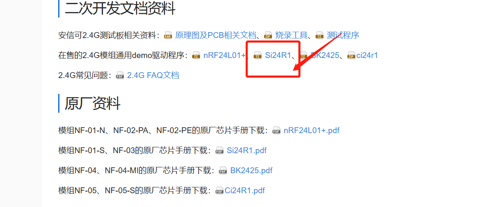

安信可 2.4G系列模块 FAQ
======

.. raw:: html

   

--------------

Si24R1芯片与nRF24L01+芯片有什么区别?
------------------------------------------------------------------------
  Si24R1芯片与nRF24L01+芯片兼容，可以直接替换。SI24R1芯片的优点就是SHDN关断状态的电流要小，standby-I状态的电流也要小，同时SI24R1芯片支持更大功率的输出7dBm，（需要软件设置内部寄存器配置使之工作在7dBm模式），SI24R1的总的平均电流消耗要比nRF24L01+的小。

Si24R1与nRF24L01+与BK2425芯片哪一个性能比较好?
------------------------------------------------------------------------

  答：从功率上比较：Si24R1最大功率是5mV>BK2425最大功率是2.5mV>nRF24L01最大功率是1mV

NF-03跟24l01兼容吗
------------------------------------------------------------------------

  兼容，支持多发一收

NF-01-S这个直接用吗 ?还是需要编程 
------------------------------------------------------------------------
  需要编程,这只是一个射频芯片

NF-04与NF-02-PA 互通吗？
------------------------------------------------------------------------
  互通的

NF-03可以供电电压5v吗
------------------------------------------------------------------------
  建议供电3V3，供电5V会烧坏芯片

NF-04-MI模块的通信距离有多远 
------------------------------------------------------------------------
  120米

NF-03模块，不需要烧写程序，直接可以透传，对吗？模块本身，上电即可工作吗？
------------------------------------------------------------------------
  这个模块需要外接MCU，需要MCU配置寄存器

如何把NF-01-N模块改成通电即发射？怎么设置呢？
------------------------------------------------------------------------
通过设置寄存器，可以参考我们提供的51单片机的demo程序

"NF-03传送距离多远？ 
------------------------------------------------------------------------

  240m

2.4G稳定性哪款好？ 
------------------------------------------------------------------------
  NF-02-PA 

发射端si24r1，接收端是nrf24l01+，可以通信吗 
------------------------------------------------------------------------
  可以通信

"NF-04多少米 
------------------------------------------------------------------------
  120米

怎么区分NF-01-N和NF-01-S
------------------------------------------------------------------------
他们使用的射频芯片不一样 可以参考芯片手册

这种3.3V供电的2.4G  NF-04-MI模块，能否与5V供电的单片机信号线直接连接
------------------------------------------------------------------------
  不行,必须设计降压电路

NF-03模块有没有程序的
------------------------------------------------------------------------
  NF-03这款是射频芯片，所以不带程序的，通过MCU寄存器去操作

NF-01-S 这个是wifi透传吗?是走wifi协议吗?
------------------------------------------------------------------------
  支持SPI透传,走的不是WIFI协议 ,是SPI协议 

NF-01-S可以做AP吗。 设备跟你们的模块连，手机APP跟模块连。实现透传。
------------------------------------------------------------------------

  SPI协议，这个只是纯射频模块，没有AP这种概念哦

2.4G系列有5V供电的吗
------------------------------------------------------------------------
  2.4G模块都是3.3V供电的，如果使用5V供电请自行设计电路进行降压

"有串口通信的2.4G模块吗
------------------------------------------------------------------------
没有，2.4g都是SPI通信的，是单2.4，不是WIFI

Nf-02可以做音频传输吧？
------------------------------------------------------------------------
  不行哦

为什么叫邦定2401模块？与普通的2401模块有什么不同？
------------------------------------------------------------------------
  使用的射频芯片不一样

NF-02是发射器吧？接收呢 
------------------------------------------------------------------------
发射和接收都可以做的 

NF-02模块的接收可以用哪些模块呢？
------------------------------------------------------------------------
发送和接收都可以用这个，2.4G属于收发模块

"NF-02   和 NF-03  在数据在 能对接的吧？ 能不有 NF-02 做一款 跟NF-03一样的接口？ 
------------------------------------------------------------------------

数据可以对接的，但是我们没有跟NF-03一样接口的NF-02 

能做遥控的是那种 
------------------------------------------------------------------------

2.4G、WIFI都可以

这款2.4G  NF-03模块实际使用过程中，最大的发射功率可以配置成多少啊？ 
------------------------------------------------------------------------
  7dbm，您可以查看我们官网的芯片手册

NF-04-MI模块需要自己往模块的芯片里面编写程序吗？ 
------------------------------------------------------------------------

  不需要

假如100个2.4G无线模块在同一个房间里，各个模块之间的信号互相有干扰吗？
------------------------------------------------------------------------
  不会有干扰的 

这个NF-03是串口透传的吗？ 有多少个信道？ 
------------------------------------------------------------------------

  不是串口透传哦,信道您可以查看芯片手册哈

是否可以将SI24R1连接至电脑并显示接受的数据？是不是有配套的硬件模块？ 
------------------------------------------------------------------------
  SI24R1模块是需要MCU去驱动才能进行使用

NF-03模块是免开发模块，还是一定要连接mcu，如果用这个模块连接RC522射频模块，可以正常工作吗
------------------------------------------------------------------------
  一定要接MCU 

2.4G模块 你们提供上位机端的测试工具吗？ 如果我使用你们的模块 那应该怎样测试这个模块的工作情况呢 
------------------------------------------------------------------------

  我们没有上位机端的测试工具，无法提供,通过MCU驱动.

NF-04-MI可以直接连串口透传吗？ 
------------------------------------------------------------------------

  不可以

NF-02延时时间是多久 
------------------------------------------------------------------------
  200ms

Nf-03这个程序和NRF24L01的通用吗 
------------------------------------------------------------------------
  通用

NF-04-MI手册上说能传输120米，实际测试10米不到，有办法提高通讯距离吗 ？如果布线好的话，能传输多远呢，速度最低的情况下，你们测试试过吗 
------------------------------------------------------------------------

  改善天线区域的布线。NF-04-MI这个不能传远距离的，如果需要传远距离推荐使用NF-03，NF-03能传输175米，NF-04-MI只能传30米

nrf24L01可以和BK2425通讯对吧 
------------------------------------------------------------------------

  可以的

NF-03，想改用ipx胶棒天线，要怎么焊接？ 
------------------------------------------------------------------------
  这个无法改用哦，上面没有预留IPEX接口，只能使用板载天线 

2.4G模块是烧录好程序的吗？透传使用
------------------------------------------------------------------------
  不能透传，NF-03只是一个射频模块，程序是已经固化好的

NF-02-PA要不要焊电容？
------------------------------------------------------------------------
  不需要焊电容 

NRF24L01,一收多发，最多可以挂几个通信？
------------------------------------------------------------------------
  6个，2.4G模块是通过SPI协议操作相关的寄存器值来传数据的

NF-02-PE这个模块，发射时电流峰值是多少
------------------------------------------------------------------------
  250mA

NF-01-N看可以提供stm32F103c8t6的例程，在哪里可以下载
------------------------------------------------------------------------

  2.4G的demo程序没有STM32的，都是51单片机的demo程序，您可以自己进行移植

这个NF-04模块支持透传的
------------------------------------------------------------------------
  支持

NF-02怎么用电脑驱动它收发信号？需要哪些工具之类的？对它的配置，只是对里面射频芯片的操作吗
------------------------------------------------------------------------

  必须搭配单片机使用。这边都是接单片机的，当然也可以接支持SPI的设备，但是必须对里面射频芯片进行操作

NF-03怎么检测他有没有发送出去
------------------------------------------------------------------------

  芯片手册上有一个状态寄存器 ，可以通过该寄存器进行检测，具体您可以查看这边提供的代码和芯片手册

NF-02用1M的空中速率，距离能到多少
------------------------------------------------------------------------
  1000米

金属外壳对距离有没有影响
------------------------------------------------------------------------
  会有影响，金属外壳会吸收天线辐射

"NF-03可以直接替换nrf24L01吗？
------------------------------------------------------------------------
  可以的

NF-03是否可稳定工作在2M传输？
------------------------------------------------------------------------

  可以的

NF-01-S怎么接温湿传感？
------------------------------------------------------------------------
  外接一个MCU，MCU上接温湿度传感器

NF-02若希望工作在2Mbps，可工作在什么距离？
------------------------------------------------------------------------
  0-500米左右

Si24R1与NRF24L01+的程序能否兼容，如果不兼容，需要修改哪些参数?
-------------------------------
不兼容，建议使用各自的驱动demo

是否有STM32系列的示例提供？
--------------------------------
没有，只有STC51单片机的驱动程序，可以参考该程序逻辑

NF-03模组能否实现一个主机配20个从机的方案？
---------------------------------
可以，该功能主要用MCU写的应用决定。

2.4G模块在1M和2M模式下，频偏为多少
----------------------
频偏为+-20ppm

NF-03与NF-05软硬件兼容吗
----------------------
03和05只是硬件封装兼容，软件由于芯片不同需要修改相关驱动

请问Si24R1型号的2.4G模组是否有自动跳频功能？
----------------------
没有

请问NF-01-S模组的驱动有STM32版本的么？
-----------------------
没有，目前只有官网上的驱动，51单片机驱动的；

2.4G模块带自动重发不
-----------------
带，具体查看寄存器手册

请问NF-05-S模块的flash有多大？
-----------------------
该模块不带MCU；

NF-05模块支持多发一收吗
----------------------
支持，具体可以从芯片手册上查询相关寄存器参数配置